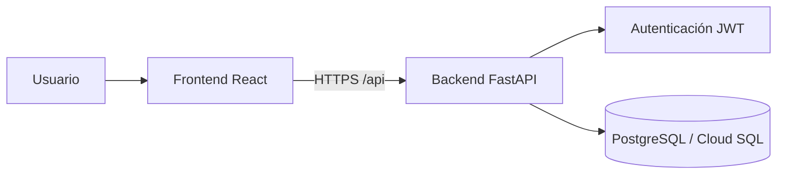

# Cunservicios Platform

Repositorio principal del proyecto Cunservicios. Incluye frontend (React), backend (FastAPI) y plantillas de despliegue en GCP.

## Alcance actual

- Portal web para consulta de facturas y radicación/seguimiento de PQR.
- API multi-tenant con autenticación JWT.
- Base preparada para despliegue productivo en Cloud Run + Cloud SQL.

## Arquitectura



## Estructura del repositorio

```text
/
├── backend/        # Servicio API
├── frontend/       # Aplicación web
├── docs/           # Documentación funcional y técnica
├── infra/gcp/      # Plantillas Cloud Build y guía GCP
└── README.md
```

## Inicio rápido local

### Backend

```bash
cd backend
python3 -m pip install -r requirements.txt
python3 -m uvicorn app.main:app --reload
```

### Frontend

```bash
cd frontend
npm install
npm start
```

## Documentación

- Índice: [docs/README.md](docs/README.md)
- Arquitectura: [docs/architecture.md](docs/architecture.md)
- Despliegue en GCP: [docs/deployment-gcp.md](docs/deployment-gcp.md)
- Roadmap técnico: [docs/roadmap.md](docs/roadmap.md)
- Backend: [backend/README.md](backend/README.md)
- Frontend: [frontend/README.md](frontend/README.md)

## Despliegue

El repositorio está preparado para:

- Cloud Run (frontend y backend)
- Cloud SQL PostgreSQL
- Dominio personalizado (por ejemplo, GoDaddy)

Archivos de referencia:

- `infra/gcp/cloudbuild.backend.yaml`
- `infra/gcp/cloudbuild.frontend.yaml`

## Licencia

Software propietario. Todos los derechos reservados.