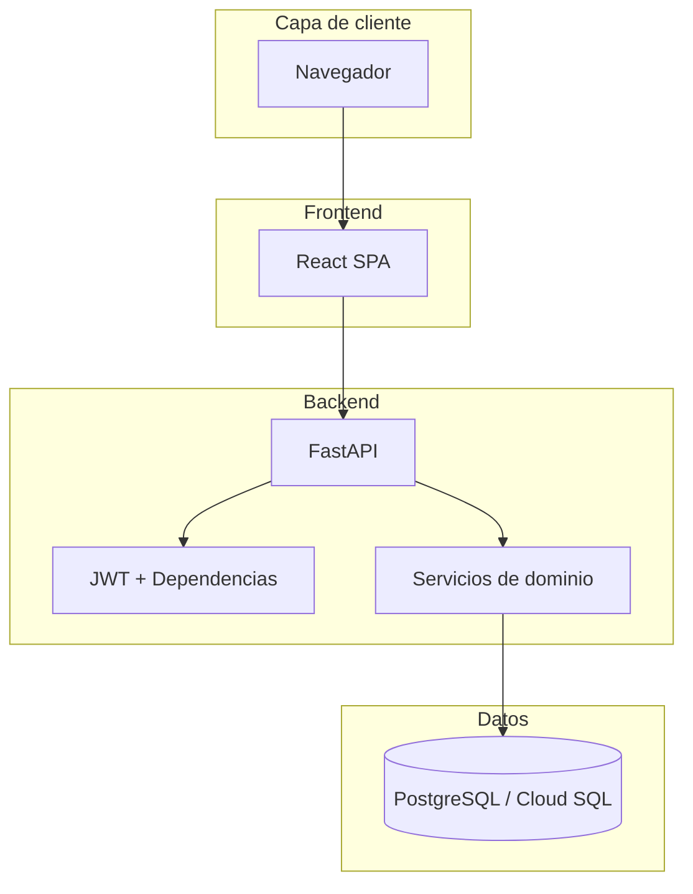
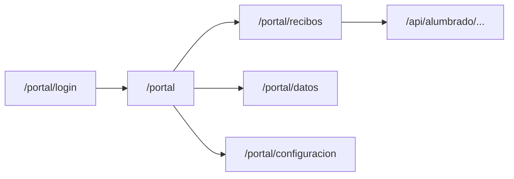
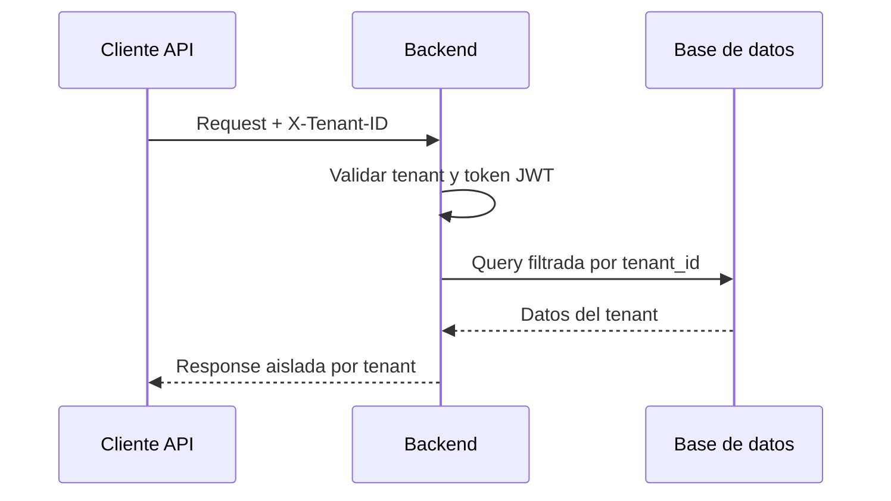

# Arquitectura

## Vista de componentes

## Principios técnicos

1. **Separación por servicios**: frontend y backend desacoplados.
2. **Aislamiento multi-tenant**: datos segmentados por `tenant_id`.
3. **Contratos explícitos**: integración frontend vía capa `services`.
4. **Configuración por entorno**: sin secretos en código fuente.

## Portal cliente (fase base)

- El portal usa una sesión inicial en frontend y permite seleccionar tenant activo.
- Los módulos se diseñaron por rutas y componentes independientes para crecer por iteraciones.
- La sesión del portal valida credenciales contra backend y aplica JWT por tenant.

## Seguridad de aplicación

- Endpoints de datos y regulación protegidos por autenticación JWT.
- Validación estricta de `tenant` en token vs `X-Tenant-ID`.
- Headers de seguridad HTTP en frontend y backend.
- Lista de hosts confiables configurable para API.

## Multi-tenant

