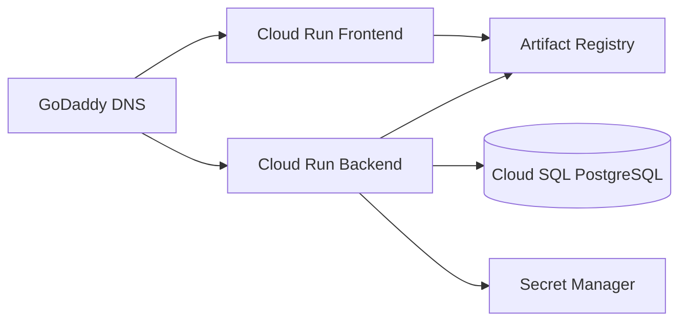

# Despliegue en GCP

Este proyecto está configurado para un despliegue escalable con Cloud Run.

## Arquitectura objetivo

## Prerrequisitos

- Proyecto en GCP.
- Artifact Registry habilitado.
- Cloud Run habilitado.
- Cloud SQL PostgreSQL creado.
- Secret Manager habilitado.

## Flujo de despliegue

1. Construir y desplegar backend con:
   - `infra/gcp/cloudbuild.backend.yaml`
2. Construir y desplegar frontend con:
   - `infra/gcp/cloudbuild.frontend.yaml`
3. Configurar DNS del dominio en GoDaddy:
   - `app.tu-dominio.com` para frontend
   - `api.tu-dominio.com` para backend
4. Actualizar CORS backend con dominio real del frontend.

## Variables críticas

### Backend

- `ENV=production`
- `DATABASE_URL`
- `SECRET_KEY`
- `BACKEND_CORS_ORIGINS`
- `DEFAULT_TENANT_ID`

### Frontend (build time)

- `REACT_APP_API_URL`
- `REACT_APP_TENANT_ID`
