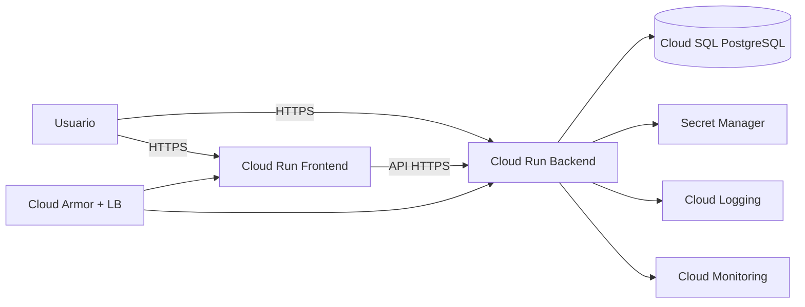

# Seguridad y protección de datos (producción)

Esta guía define el baseline mínimo para operar la plataforma en nube con controles de seguridad y protección de datos.

## Objetivos

- Proteger información de usuarios y entidades cliente (multi-tenant).
- Reducir superficie de ataque en frontend y backend.
- Asegurar trazabilidad operativa y recuperación ante incidentes.

## Arquitectura de seguridad objetivo

## Controles implementados en código

- JWT multi-tenant con validación estricta de tenant.
- Endpoints de datos protegidos con autenticación.
- Endurecimiento de login con bloqueo temporal por intentos fallidos.
- Headers de seguridad en backend y frontend.
- Trusted hosts en API.
- CORS configurable por entorno.

## Secretos y configuración sensible

Todos los secretos deben vivir en **Secret Manager**, no en variables planas de CI:

- `cunservicios-secret-key`
- `cunservicios-database-url`

Recomendado:

- Rotación trimestral de `SECRET_KEY`.
- Rotación semestral de credenciales de base de datos.
- Registro de cambios de secreto (auditoría).

## IAM y principio de mínimo privilegio

- Separar cuentas de servicio para frontend y backend.
- Cloud Build con permisos mínimos para:
  - Artifact Registry Writer
  - Cloud Run Admin
  - Service Account User (solo cuentas objetivo)
  - Secret Manager Secret Accessor (solo secretos requeridos)
- Sin llaves estáticas descargadas.

## Datos en Cloud SQL

- PostgreSQL administrado en Cloud SQL.
- Backups automáticos diarios habilitados.
- PITR (Point-in-time recovery) habilitado.
- Cifrado en reposo administrado por GCP (opcional CMEK en fase avanzada).
- Conectividad privada recomendada para backend (Serverless VPC Connector).

## Seguridad de perímetro

- HTTPS obligatorio.
- Dominios y certificados gestionados.
- Cloud Armor con reglas base:
  - Protección de fuerza bruta para `/api/auth/login`.
  - Rate limit por IP para endpoints sensibles.
  - Reglas OWASP preconfiguradas.

## Observabilidad y respuesta

- Alertas en Cloud Monitoring:
  - 5xx elevados.
  - Latencia p95 alta.
  - Pico de 401/403/429.
- Logs estructurados centralizados en Cloud Logging.
- Procedimiento de incidente:
  1. Contención (bloqueo reglas/credenciales).
  2. Erradicación (parches/rotaciones).
  3. Recuperación (validación funcional y de seguridad).
  4. Postmortem con acciones preventivas.

## Checklist de salida a producción

- [ ] `ENV=production`, `DEBUG=false`.
- [ ] `ENABLE_HTTPS_REDIRECT=true`.
- [ ] `ENABLE_SECURITY_HEADERS=true`.
- [ ] `ENFORCE_AUTH_ON_DATA_ENDPOINTS=true`.
- [ ] `ALLOWED_HOSTS` configurado con dominios reales.
- [ ] `BACKEND_CORS_ORIGINS` restringido al frontend real.
- [ ] Secretos cargados en Secret Manager.
- [ ] Cloud SQL con backup/PITR habilitado.
- [ ] Alertas y tableros activos.
- [ ] Pruebas de login, autorización y aislamiento tenant ejecutadas.
